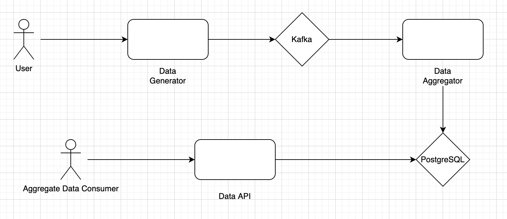

# Kafka Data Pipeline

## Architecture



## Run Application

1. To run application:

```
docker-compose up --build -d
```

This will start Kafka cluster with 1 zookeeper and start `data-generator` application that automatically creates the `stocks` kafka topic and sends the json message.

2. To Check if messages are being stored in the Kafka topic : 

```
docker-compose exec kafka bash
cd /opt/kafka
/bin/kafka-console-consumer.sh --from-beginning --bootstrap-server kafka:9092 --topic=stocks
```
3. Get container ID from container name
```
docker ps -aqf "name=containername"
```
3. Check the prices of the stocks using Flask REST API
```
1. get the http address to access the data
    docker logs data-api

2. use the last http address and run the api to get the distinct prices
    <ip address>/vi/get-prices
3. <Not working>use the last http address and run the api to get the prices for specific time stamp
    <ip address>/vi/filter-prices?start_time="something",end_time="somettime"
```
4. To print all the details regarding all the msgs like Message, key, headers, timestamp
```
docker-compose exec kafka bash
cd /opt/kafka
./bin/kafka-console-consumer.sh \
	--from-beginning \
	--bootstrap-server kafka:9092 \
	--topic=stocks \
	--formatter kafka.tools.DefaultMessageFormatter \
	--property key.deserializer=org.apache.kafka.common.serialization.StringDeserializer \
	--property value.deserializer=org.apache.kafka.common.serialization.StringDeserializer \
	--property print.key=true \
	--property print.headers=true \
	--property print.timestamp=true
```
4. To login into POSTGRES container, execute the following command
```
docker ps -a # to check the postgres container ID
docker exec -it <container_id> sh

# once inside the container login to DB, using the below command
psql -U <db_username> <db_name>

# visualize the table
select * from SSEX;

